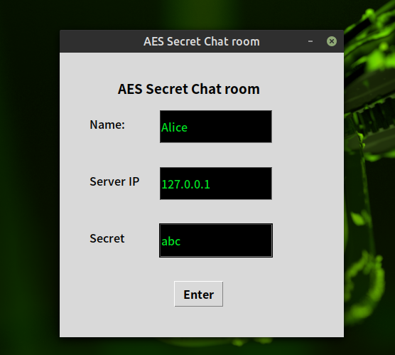

# AES-ChatRoom
## AES-ChatRoom using AES CCM or GCM by 蕭維均

# Enviroment requirement

## Ubuntu
Require PyCryptodome module
```
pip3 install -U PyCryptodome
```

## Windows

Require python3,MSVC v142 x64/x86 or MSVC v140 x64/x86

```
pip install pycryptodomex --no-binary :all:
pip install PyCryptodome
```

please read PyCryptodome official tutorial

[https://pycryptodome.readthedocs.io/en/latest/src/installation.html](https://pycryptodome.readthedocs.io/en/latest/src/installation.html)

# Run

After you have the python eviroment and PyCryptodome,you can run it.

### 1.server side

You have to start a server on one machine before using client to chat,if you don't have another machine you can run server side ande client side in your computer the same time.

```
python3 Server.py
```

### 2.client side

Runing client side will show the GUI and you can start to connect server.

```
python3 Client.py
```

You can choose AES GCM or CCM by input parameter like following:

```
python3 Client.py --GCM
```

or

```
python3 Client.py --CCM
```




# Download Source file

[DownloadSourceFIle](https://github.com/AlexTrinityBlock/RSA-AES/archive/refs/heads/master.zip)

# Download Binary

**Warning!!!**
 
**If you run on Windows,Please try to using python script because Microsoft Defender will autoremove this binary version RSA-AES program**

[Ubuntu20.04]() 